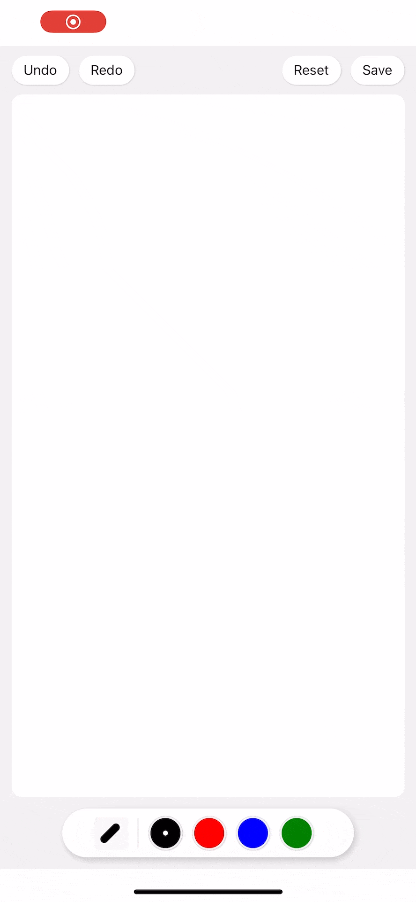

# rn-custom-sketch-canvas

A React Native component for drawing perfect pressure-sensitive freehand lines using [perfect-freehand](https://github.com/steveruizok/perfect-freehand) and [Skia renderer](https://shopify.github.io/react-native-skia/).



## Installation

```sh
npm install @shopify/react-native-skia rn-custom-sketch-canvas
```

## Usage

```tsx
import React, { useRef } from 'react';
import { StyleSheet, SafeAreaView, Button } from 'react-native';
import { SketchCanvas } from 'rn-custom-sketch-canvas';

export default function App() {
  const canvasRef = useRef();

  return (
    <SafeAreaView style={styles.container}>
      <SketchCanvas
        ref={canvasRef}
        strokeColor={'black'}
        strokeWidth={8}
        containerStyle={styles.container}
      />
      <Button onPress={canvasRef.current?.reset} title="Reset" />
    </SafeAreaView>
  );
}

const styles = StyleSheet.create({
  container: {
    flex: 1,
  },
});
```

## Props

| Property         | Type      | Default | Description                                     |
| ---------------- | --------- | ------- | ----------------------------------------------- |
| `containerStyle` | object    | {}      | Styles to be applied on canvas component.       |
| `strokeColor`    | string    | black   | Color of stroke.                                |
| `strokeWidth`    | number    | 8       | Size (diameter) of the stroke.                  |
| `topChildren`    | ReactNode |         | Node to be put on top of sketch                 |
| `bottomChildren` | ReactNode |         | Node to be put on bottom of sketch (Background) |

## Methods

| Method                                                           | Description                                                 |
| ---------------------------------------------------------------- | ----------------------------------------------------------- |
| `reset()`                                                        | Clear all the paths.                                        |
| `undo()`                                                         | Undo                                                        |
| `redo()`                                                         | Redo                                                        |
| `toBase64(format?: ImageFormat, quality?: number)`               | Get the base64 of image.                                    |
| `toImage()`                                                      | Get a snapshot from the canvas in the surface.              |
| `toSvg(width: number, height: number, backgroundColor?: string)` | Get the svg string of all paths.                            |
| `toPoints()`                                                     | Get the array of point groups that got drawn in the canvas. |
| `addPoints(points: [x, y][][])`                                  | Draws from an array of point groups.                        |

## Contributing

See the [contributing guide](CONTRIBUTING.md) to learn how to contribute to the repository and the development workflow.

## Inspired By

Please check out these previous works that helped inspire the creation of rn-custom-sketch-canvas.

- [wobsoriano/rn-perfect-sketch-canvas](https://github.com/wobsoriano/rn-perfect-sketch-canvas) - A React Native component for drawing perfect pressure-sensitive freehand lines using perfect-freehand and Skia renderer.

## License

MIT
